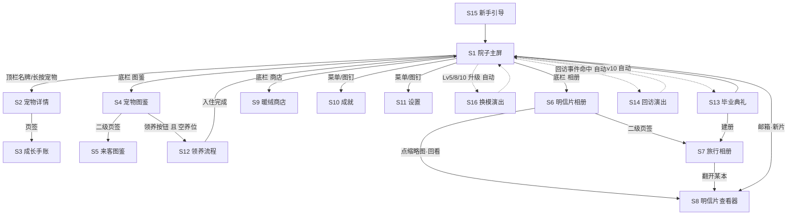

# Petopia 实现规格 · UX · v0.3 · 配套 DESIGN.md

> 本文件是给开发者（后续由 Codex CLI 实现）看的**实现级界面与交互规格**。目标：照做即可，无需猜测。
> 术语、数值、系统规则以 `DESIGN.md`（v0.2）为准，本文件不重复定义规则，只把它们**落成屏幕、控件、时序与验收点**。
> 标记：`[待细化]` = 结构已定、细节留待补齐；`[待验证]` = 数值/交互需 playtest 校准。
> 语气红线：手绘水彩手账风、治愈、零焦虑。所有文案参照手账体（第一人称暖场、非说教）。

---

## 目录

- 0. 全局 UX 约定（坐标系、层级、通用组件、动效、状态词汇）
- 1. 屏幕清单（Screen Inventory）
- 2. 导航图（Navigation Map）
- 3. 院子主屏详规（YardScene）
- 4. 关键交互流程（分步时序）
- 5. 首次启动 / 新手引导
- 6. 通知规格（本地通知）
- 7. 零焦虑 UI 红线（Dos / Don'ts）
- 8. 待细化清单

---

# 0. 全局 UX 约定

## 0.1 设计基线

- **画布/坐标**：以逻辑分辨率设计，UI 用 Flutter 手账套件，场景用 Flame（`YardScene`）。竖屏为主，横屏不支持（明信片查看器可临时横看，见 §1）。`[待细化]` 具体设计分辨率。
- **安全区**：顶栏、底栏均避让刘海/Home 指示条。
- **配色**：米黄底 `#FAF3E3` 系为默认纸底；出线 1–2px「笨拙感」描边；暖色主调。深色/夜景由主题层与时段滤镜叠加，不做系统级 Dark Mode 反色。
- **字体**：标题=铅笔手写体；正文=圆润无衬线手写感字体。`[待细化]` 字体选型。

## 0.2 通用组件库（复用，全局统一）

| 组件 | 用途 | 视觉 | 交互 |
|---|---|---|---|
| `TapeButton` 胶带按钮 | 主要动作（领养、领取、确认） | 撕边胶带贴纸 + 手写字 | 按下时轻微「按皱」形变 + 水彩点击涟漪 |
| `ClipTab` 回形针页签 | 底栏/相册页签切换 | 图钉/回形针夹住纸角 | 点击翻页，选中态纸角翘起 |
| `StickerCard` 贴纸卡 | 图鉴格、成就格、商品卡 | 圆角贴纸 + 淡阴影 | 点击进入详情 |
| `WatercolorHourglass` 水彩沙漏 | **冷却态唯一表现** | 小沙漏水彩图标，沙粒缓降；按钮同时置灰 | 不可点；长按显示「还需歇一会儿」气泡（不显示精确秒数红字） |
| `SoftToast` 软吐司 | 轻反馈（+经验、+暖绒） | 纸条从底部滑入，2s 淡出 | 无阻塞，不打断操作 |
| `WashTransition` 晕染转场 | 所有页面切换 | 水彩从中心/边缘晕开覆盖再化开 | 300–500ms `[待验证]` |
| `MailboxBadge` 邮箱提示 | 未读明信片/事件入口 | 邮箱旗子立起 + 柔和光晕（**非红点**） | 点击进入明信片查看器/事件 |
| `PawConfirm` 爪印确认弹层 | 不可逆动作确认（如切换主题、重掷变体） | 纸质小卡片，柔和落下（非硬弹窗） | 确认/取消，均为胶带按钮 |

> **禁止**：系统原生 Alert 硬弹窗、红色数字角标、倒计时红字、震动式强提醒。

## 0.3 全局状态词汇（供开发对齐）

- 宠物状态：`RAISING`（在养）/ `TRAVELING`（旅行寄片）/ `ROAMING`（世界漫游·回访源）/ `REVISITING`（回访中）。
- 图鉴格状态：`OWNED_BEFORE` / `AVAILABLE` / `LOCKED_KNOWN` / `LOCKED_HIDDEN`（见 DESIGN §1.2）。
- 动作按钮态：`READY`（可点）/ `COOLING`（沙漏置灰）/ `DAILY_MAXED`（今日已满，显示「今天够啦」文案，非报错）。

## 0.4 动效与音效基调

- 所有转场用 `WashTransition`；升级/换模/毕业用彩带 + 水彩晕染，无闪光刺激。
- 音效：翻纸、铅笔沙沙、柔和铃铛、水彩「噗」；无尖锐提示音。可在设置全关。

---

# 1. 屏幕清单（Screen Inventory）

> 每屏给出：用途 / 信息与控件 / 可执行交互 / 进入·退出。演出类（毕业/回访/换模）以「叠加演出层」形式覆盖当前屏，不是独立路由，但因其体验重要单列。

### S1. 院子主屏（YardScene / Home）
- **用途**：核心屏。展示当前宠物、院子、访客、天气、事件入口。详见 §3。
- **信息与控件**：顶栏（宠物名牌+等级徽章+经验条、暖绒余额）、场景层（背景/豪华度布局/宠物/访客/粒子）、底栏导航、邮箱、菜单入口、照料动作条。
- **交互**：点宠物触发互动动作；点食盆放置食物；点邮箱看明信片/事件；点访客互动；底栏跳转。
- **进入**：冷启动默认屏、任意屏返回。**退出**：进入其他一级屏（保留 YardScene 后台状态）。

### S2. 宠物详情页（Pet Detail）
- **用途**：查看当前在养宠物的档案。
- **信息与控件**：大幅肖像、名字、物种、2 个性格标签（贴纸）、变体、等级/阶段、累计经验、领养日期、当前 Journey 预告（仅 Lv10 后）。页签：`档案` / `成长手账`(→S3)。
- **交互**：点性格标签看人设说明；点肖像看当前动作循环；进「成长手账」。
- **进入**：主屏点顶栏名牌 / 点宠物长按。**退出**：返回主屏。

### S3. 成长手账页（Growth Journal）
- **用途**：可审计经验流水（DESIGN §3.4）的手账化展示。
- **信息与控件**：按天分组时间线（时间+图标+短语+delta+levelAt）；来源类型筛选 chips（🍚喂/✋摸/🎈事件/🌙离线…）；每日/每周小结水彩饼图；升级条目带「🎉升级」徽章。
- **交互**：滚动浏览；切换筛选 chips；点某条看完整 note。毕业后此页归档进旅行相册可回看。
- **进入**：S2 页签。**退出**：返回 S2 / 主屏。

### S4. 宠物图鉴（Pet Codex）
- **用途**：手账贴纸册，每物种一格，4 态展示 + 领养入口。
- **信息与控件**：网格贴纸格；每格按状态显示（彩色画/铅笔剪影+锁/问号水彩渍）。`AVAILABLE` 格带「领养」按钮；`LOCKED_KNOWN` 显示明文条件+进度条（如 2/3）；`LOCKED_HIDDEN` 显示模糊线索或「？？？」；`OWNED_BEFORE` 显示毕业徽章+历任名字列表。
- **交互**：点格看详情；`AVAILABLE` 点「领养」进领养流程（S12）。**注意**：仅当当前无在养宠物时领养按钮可用，否则置灰并提示「先送 TA 毕业哦」。
- **进入**：底栏「图鉴」→ 页签「宠物」。**退出**：底栏切换。

### S5. 来客图鉴（Visitor Codex）
- **用途**：访客收录册（DESIGN §8.5）。
- **信息与控件**：每访客一格：水彩肖像、到访次数、首次到访日期、已解锁互动小故事列表；未收录=剪影+触发提示（常见/不常见写明条件；传说给模糊线索）。
- **交互**：点已收录格看小故事列表；点未收录格看提示。
- **进入**：底栏「图鉴」→ 页签「来客」。**退出**：底栏切换。

### S6. 明信片相册（Postcard Album）
- **用途**：全宠物全明信片的集邮册，按收到时间排序（DESIGN §6.6）。
- **信息与控件**：明信片缩略网格；筛选（按地点/宠物/邮戳）；邮戳收集进度条。
- **交互**：点缩略图 → 明信片查看器（S9，回看模式，无收信演出）；切换筛选。
- **进入**：底栏「相册」→ 页签「明信片」。**退出**：底栏切换。

### S7. 旅行相册（Travel Album）
- **用途**：按「宠物→旅程」组织的手账本，一只一本（DESIGN §6.6）。
- **信息与控件**：书架/封面列表（封面=宠物肖像）；点开一本 = 成长手账摘要 + 该旅程明信片 + 回访记录。毕业即建册。
- **交互**：点封面翻开该宠物的本；本内翻页查看。
- **进入**：底栏「相册」→ 页签「旅行」。**退出**：返回书架 / 底栏切换。

### S8. 明信片查看器 / 收信演出（Postcard Viewer / Receive Show）
- **用途**：阅读单张明信片；新片到达时的收信演出。
- **信息与控件**：明信片正反面（正面=水彩照片插画+邮戳；背面=手写正文+落款）；翻面手势；「下一张/上一张」（若批量）。
- **交互**：**收信演出模式**——邮箱打开→信封飘落→盖章音效→翻面阅读；**回看模式**（从相册进）——直接展示，无演出。可横持放大看插画。
- **进入**：主屏邮箱（新片，演出模式）/ S6·S7（回看模式）。**退出**：返回来源屏。

### S9. 暖绒商店（Warm Fluff Shop）
- **用途**：暖绒消费（DESIGN §4.3）。
- **信息与控件**：分类页签（院子主题/装饰小物/特殊食粮/特殊玩具/明信片皮肤）；商品卡（图标+名+价+效果说明）；顶部暖绒余额；已拥有项标「已拥有」。
- **交互**：点商品卡看详情→「兑换」（`PawConfirm` 确认）；余额不足则按钮置灰+柔和提示（非报错）。主题/永久强化购买后即时生效。
- **进入**：主屏菜单「商店」入口。**退出**：返回主屏。

### S10. 成就页（Achievements）
- **用途**：明写成就（进度可见）+ 隐藏成就（谜语线索）。
- **信息与控件**：两分区：`明写`（名/条件/进度条/奖励/已达成徽章）、`隐藏`（未达成=「？？？」+线索句；已达成=名字+插画）。
- **交互**：滚动浏览；点已达成成就看奖励领取状态（奖励自动发放，此处仅展示）。
- **进入**：主屏菜单「成就」入口。**退出**：返回主屏。

### S11. 设置页（Settings）
- **用途**：通知开关、音效、存档、关于（DESIGN §11.1）。
- **信息与控件**：通知总开关 + 分类开关（明信片/回访/特殊事件/生日会…）；音效/音乐开关；存档导出·导入 `[待细化]`；schema 版本/关于/致谢。
- **交互**：拨动开关即时生效；导出/导入走系统文件选择器。
- **进入**：主屏菜单「设置」入口。**退出**：返回主屏。

### S12. 领养流程（Adoption Flow，多步）
- **用途**：从选定物种到幼崽入住。详见 §4.1。
- **步骤屏**：①物种介绍确认 → ②随机生成个体展示（变体+2性格，可重掷变体 1 次/日）→ ③取名 → ④入住演出。
- **进入**：S4 图鉴点「领养」。**退出**：完成→回主屏（新宠已入住）；中途返回=取消。

### S13. 毕业典礼演出（Graduation Ceremony，叠加演出层）
- **用途**：Lv10 一次性剧情事件 + 暖绒结算（DESIGN §3.5/§4.2）。详见 §4.7。
- **信息与控件**：剧情演出画面、暖绒结算明细卡、「目送出发」动作。
- **交互**：点进演出（不可跳过关键情感帧，但可点「继续」推进）；结算卡点「收下」。
- **进入**：宠物达 Lv10 上线时自动触发。**退出**：演出结束→旅行相册建册→回主屏（空院/可领养态）。

### S14. 回访演出（Revisit Show，叠加演出层）
- **用途**：毕业宠回院子串门（DESIGN §7）。详见 §4.5。
- **信息与控件**：铃铛声+邮箱旁身影入场；回访宠出现在专属位（篱笆边/落脚小屋）；可摸头 1 次/天、领小礼物、观看与在养宠专属互动。
- **交互**：点回访宠摸头/互动；领礼物。
- **进入**：回访事件命中当日、上线时演出。**退出**：停留 1–2 天，期间常驻主屏；离开时轻演出。

### S15. 首次启动 / 新手引导（Onboarding）
- **用途**：冷启动、引导领养第一只、讲清核心情感。详见 §5。
- **信息与控件**：极简开场（品牌+一句话概念）、旁白手账卡、第一只领养引导。
- **交互**：跟随引导点击；无强制注册、无账号。
- **进入**：首次冷启动（存档为空）。**退出**：完成→主屏。

### S16. Lv5/8/10 换模演出（Evolve Show，叠加演出层）
- **用途**：成长换模的彩带+水彩晕染演出（DESIGN §3.5/§3.6）。详见 §4.6。
- **交互**：观看晕染换模；徽章纹样更新提示。
- **进入**：升级跨越 Lv5/8/10 阈值时自动。**退出**：回主屏。

---

# 2. 导航图（Navigation Map）

## 2.1 底栏导航（一级，常驻主屏与图鉴/相册/商店等）

底栏为 4 个回形针页签（`ClipTab`）+ 中央院子键：

```
[图鉴]   [相册]   ( 🏡 院子 )   [商店]   [菜单]
```

- 中央「院子」= 返回 S1 主屏（放大凸起）。
- 「图鉴」→ 内含二级页签：宠物图鉴(S4) / 来客图鉴(S5)。
- 「相册」→ 内含二级页签：明信片相册(S6) / 旅行相册(S7)。
- 「商店」→ S9。
- 「菜单」→ 抽屉，含：成就(S10)、设置(S11)、宠物详情(S2) 快捷入口。

> 说明：也可将「成就/设置」直接做成主屏角落的小图钉入口（见 §3.6），底栏「菜单」作为兜底聚合。二选一由实现决定，`[待细化]`；两处都提供更零门槛。

## 2.2 全局跳转关系（Mermaid）



## 2.3 演出层与路由的关系

- S13/S14/S16 是**叠加在主屏之上的全屏演出层**，触发时机由 `EventScheduler` 在**上线时**判定并入队，逐个播放（同一上线多个演出按 换模 > 毕业 > 事件 > 回访 顺序，`[待验证]`）。
- 演出层期间禁用底栏；结束后回到主屏并刷新状态。
- 明信片收信演出（S8 演出模式）也在上线时判定，排在其他演出之后或由邮箱旗子承接（不强制打断），见 §4.3。

---

# 3. 院子主屏详规（YardScene）

## 3.1 分层结构（从后到前，Flame 层级）

| z | 层 | 内容 | 数据源 |
|---|---|---|---|
| 0 | 主题背景层 | 天空/远景/配色（随 `activeThemeId`） | `YardState.activeThemeId` |
| 1 | 豪华度布局层 | 草皮/篱笆/树/池塘/门廊等设施（随 `luxuryStage` ①–⑥） | `YardState.luxuryStage` |
| 2 | 可放置物层 | 食盆、装饰小物、功能物（邮箱/相册架/纪念墙） | `YardState.slots` / `foodTray` |
| 3 | 回访宠层 | 回访宠位于专属位（篱笆边/落脚小屋），`REVISITING` 时出现 | 回访事件 |
| 4 | 宠物层 | 当前在养宠物（Spine/序列帧），按性格播待机/动作 | `Pet` |
| 5 | 访客层 | 当前访客（若有），位于食盆/水碗/树荫附近 | 访客判定 |
| 6 | 天气/时段粒子层 | 雨/雪/花瓣/萤火虫/极光滤镜（随 timeCtx 与主题） | 时钟+天气+主题 |
| 7 | UI 覆盖层 | 顶栏、底栏、动作条、邮箱旗、菜单图钉、演出层 | — |

> 时段/天气与真实时间弱同步（DESIGN §6.3 timeCtx 思路）；夜景由豪华度⑤+主题共同决定明暗，不做刺眼切换。

## 3.2 顶栏（z7 上部）

- 左：**宠物名牌**（挂在小木牌上）——名字 + 等级徽章（阶段纹样：蛋壳/嫩芽/花朵/翅膀，见 DESIGN §3.6）+ 幼崽期挂「幼」字木牌。点击 → S2 详情。
- 名牌下方细经验条（水彩描边，非满格红），只显示进度不显示「差 N 升级」焦虑数字；可点显示「再陪陪 TA 就长大啦」气泡。
- 右：**暖绒余额**（发光绒毛图标 + 数字）。点击 → S9 商店。

## 3.3 宠物点击热区与互动动作触发

- **热区**：宠物身体 = 主热区，点击触发**上下文互动**——
  - 若手上无「动作意图」：单点 = 摸头（走摸头动作 + 性格反应动画；受摸头冷却约束，冷却中点击=宠物看你一眼的待机反应，不报错）。
  - 头部热区 = 摸头；身体侧 = 蹭一蹭待机彩蛋（无经验，纯反馈）。`[待细化]` 分区细化。
- **动作条**（z7 下部，主屏常驻，位于底栏上方）：4 个 `TapeButton` —— `喂食` / `摸头` / `玩玩具` / `洗澡`。
  - 每个按钮：`READY` 可点；`COOLING` 置灰 + `WatercolorHourglass`；`DAILY_MAXED` 显示「今天够啦」文案（DESIGN §3.1 各动作每日上限）。
  - 点击 → 播放对应互动动画（动画锁 2–4s，状态 `INTERACT`）→ 结算经验 → `SoftToast` +N → 按钮进入冷却。
  - `喂食`/`玩玩具` 若拥有特殊食粮/玩具，长按可选普通/特殊（特殊走 ITEM_BONUS 加成，DESIGN §4.4）。
- **洗澡**：每日 1 次（非冷却计时，跨自然日重置）；猫/蛇播「不情愿」性格动画。

## 3.4 食盆放置（访客系统入口）

- 食盆（z2）位于院子固定锚点（豪华度①即有木食盆）。点击食盆 → 弹出**放置抽屉**：谷粒/小鱼干/坚果/苹果片/（空）。
- 选择后播放「摆好食物」小动画；影响访客到访权重（DESIGN §8.3 M_food）。空盘不惩罚，仅所有访客 ×0.8。
- 抽屉内显示每种食物「更容易招来谁」的柔和图鉴提示（如「小鱼干 · 三花猫爱来」）。

## 3.5 事件弹出演出

- 上线时 `EventScheduler` 生成 1–3 个 DAILY 事件（DESIGN §9.1），以**手账卡从纸面浮现**的方式演出（非硬弹窗）：短文案（1–3 句手账体）+ 宠物播对应动画。
- 含二选一分支的事件（如 ev_d12/16/24）：卡片下方两个 `TapeButton` 选项，选后播 resultScript + 结算 expDelta。
- SPECIAL 事件附插画，演出更完整（DESIGN §9.3）。所有事件结算写 `ExpLogEntry`。
- 演出结束回 IDLE；多个事件依次排队，不并发轰炸。

## 3.6 入口位置总表（主屏）

| 入口 | 位置 | 目标 |
|---|---|---|
| 宠物名牌 | 顶栏左 | S2 宠物详情 |
| 暖绒余额 | 顶栏右 | S9 商店 |
| 邮箱（`MailboxBadge`） | 场景内固定物（豪华度升级后红邮筒），有新片/事件时旗子立起+光晕 | S8 明信片查看器 / 事件 |
| 食盆 | 场景内锚点 | 放置抽屉（§3.4） |
| 动作条 | 底栏上方常驻 | 触发照料动作 |
| 底栏 图鉴/相册/商店/菜单 | 底栏 `ClipTab` | S4/S6/S9/菜单 |
| 图钉·成就 | 主屏右上角小图钉 | S10 成就 |
| 图钉·设置 | 主屏右上角小图钉 | S11 设置 |
| 相册架 / 纪念墙 | 豪华度④/⑥ 后场景内实体，可点 | S6/S7（实体化入口，`[待细化]`） |

## 3.7 主屏验收点

- 冷启动进入主屏后应看到：当前宠物在待机、顶栏名牌与经验条、底栏、动作条、邮箱物、食盆。
- 点宠物应触发摸头（若 READY）并出现 `SoftToast +1` 且经验条微涨。
- 无任何红点、红字、倒计时。冷却中的动作按钮显示水彩沙漏且置灰。

---

# 4. 关键交互流程（分步时序）

## 4.1 领养一只宠物

前置：当前无 `RAISING` 宠物（否则图鉴领养按钮置灰）。

1. S4 图鉴 → 点某 `AVAILABLE` 格 → 「领养」`TapeButton`。
2. **步①物种介绍**：展示物种彩色插画 + 基调关键词 + 「就选它啦」确认。
3. **步②随机生成个体**：系统按 `物种 × 变体(5选1加权) × 性格(10选2)` 生成，展示：变体外观 + 2 个性格贴纸 + 人设一句话。提供「换一个样子」= 重掷变体（**限 1 次/日**，用后置灰并显示「明天还能再挑一次」，走 `PawConfirm`）。性格不可重掷。
4. **步③取名**：文本输入（默认给一个可爱建议名，可改）。
5. **步④入住演出**：幼崽 `WashTransition` 落入院子 → 顶栏出现名牌（挂「幼」木牌，蛋壳纹徽章）→ 状态 `RAISING`, Lv1, exp 0，写 `bornAt`。
6. **验收**：完成后回主屏，应看到新幼崽在院子待机、顶栏名牌为新名字与「幼」牌、经验条为空、可立即照料。图鉴该格转为「在养中」态。

## 4.2 一次带冷却的照料动作（含冷却态表现）

以「喂食」为例（DESIGN §3.1：+3，冷却 15min，每日 12 次）：

1. 动作条 `喂食` 处于 `READY`。玩家点击。
2. 宠物走到食盆播「吃」动画（动画锁 ~2–4s，状态 `INTERACT`，此间其他动作按钮短暂锁定）。
3. 结算：写 `ExpLogEntry(FEED,+3)`；`SoftToast「早饭吃得喷香 +3」`；若跨等级阈值→触发升级/换模演出（§4.6）。
4. 按钮转 `COOLING`：置灰 + `WatercolorHourglass`，沙粒缓降表示进度。**不显示「14:59」红字**；长按沙漏显示「TA 还在回味呢～」气泡。
5. 冷却结束（15min）：沙漏化开，按钮恢复 `READY`（无强提醒音，无红点）。
6. 达每日上限（12 次）后：按钮转 `DAILY_MAXED`，显示「今天吃得够饱啦」，次日自然重置。
7. **贪吃性格**：经验 +10%（写日志时体现），可附专属「舔嘴」动画。
8. **验收**：喂食后手账（S3）应新增一条 `🍚 ... +3 (LvX)`；`pet.exp` 增量与日志一致（不变量：exp==Σdelta）。

## 4.3 收到并阅读明信片

前置：存在 `TRAVELING`/`ROAMING` 宠物，`Journey.nextPostcardAt` 到期。

1. 后台/上线时 `PostcardGenerator` 生成 `Postcard`（DESIGN §6.3 管线），入 `postcardAlbum` + `travelAlbum`。
2. 触发**本地通知**（若开启）：「邮箱里有新明信片！」（§6）。
3. 上线主屏：邮箱旗子立起 + 柔和光晕（`MailboxBadge`，非红点）。**不打断**当前操作。
4. 玩家点邮箱 → S8 **收信演出模式**：邮箱开→信封飘落→盖邮戳（音效）→明信片正面（水彩照片插画+邮戳）。
5. 翻面手势 → 背面手写正文（按性格文风渲染的定稿 `bodyText`）+ 落款（宠物名）。
6. 阅读完「收好」→ 明信片归入相册；旗子落下。若多张：可「下一张」。
7. 若明信片 `cluesTo` 非空：在来客/宠物图鉴对应线索计数 +1（无打扰提示，静默记录，图鉴内可见进度）。
8. **验收**：读毕后 S6 明信片相册应新增该片，邮戳收集进度更新；旅行相册对应宠物的本内也可见。回看时（从相册进）无收信演出。

## 4.4 一次访客到访与互动

1. 到访判定：晨 6–9 / 晚 18–21 两窗口，按 `Base × 各修正因子` 轮盘（DESIGN §8.2/§8.3）。
2. 上线时若命中：访客出现在 z5 层（食盆/水碗/树荫旁），播入场小动画（无强提示）。首次到访 → 自动收录来客图鉴（`VisitorLogEntry`）。
3. 玩家点访客 → 触发「访客 × 在养宠物」专属互动事件（DESIGN §8.4 选取规则：exact>species>fallback）：播 script 手账短文 + `animRef` 动画。
4. 结算：在养宠 +expReward（3–6，`source=VISITOR`）写日志；`SoftToast`。
5. 若 `unlockClue` 非空：静默计数（如 星星虫 → starbug+1），图鉴线索进度更新。
6. 访客停留一段后自行离开（轻演出）。
7. **验收**：来客图鉴该访客到访次数 +1、解锁对应互动小故事；在养宠手账新增一条 VISITOR 经验。传说访客（星星虫/火光等）触发对应彩蛋线索计数。

## 4.5 一次回访事件（Revisit）

1. `daily_tick` 判定：`roamingPets` 中 `nextRevisitAt<=today` 且当前无回访者 → 取最早者，`spawnEvent(REVISIT, stay=1–2d)`（DESIGN §7.2）。
2. 上线演出（S14）：熟悉铃铛声 + 邮箱旁身影 → 回访宠走到专属位（豪华度④+ 为落脚小屋，否则篱笆边）。不占在养 slot、不吃照料冷却。
3. 回访内容（DESIGN §7.3）：
   - 点回访宠 → 可摸头 **1 次/天**（播它幼年动作的「长大版」回忆动画）。
   - 带小礼物：暖绒 10–20 / 装饰贴纸 / 特殊零食 ×1 → `SoftToast` 领取。
   - 与在养宠专属互动事件（回访物种 × 在养物种）：播文本+动画，在养宠 +5（`source=REVISIT`）。
   - 20% 概率带「旅途新朋友」（一次特殊访客登场，记来客图鉴，可作彩蛋线索）。
4. 停留 1–2 天，期间常驻主屏；离开时轻演出，`nextRevisitAt = now + random(7d,14d)`。
5. **验收**：回访期间主屏可见回访宠于专属位；摸头每日限 1 次（用后至次日置灰但无红字）；在养宠手账出现 REVISIT +5；`ach_revisit_10` 等成就计数推进。

## 4.6 Lv5 / 8 / 10 换模演出（Evolve）

1. 照料/事件使 `exp` 跨越阶段阈值（Lv5→B少年 / Lv8→C成年 / Lv10→D旅装，DESIGN §3.6）。
2. 先播常规升级微反馈（手账「🎉升级」+ `SoftToast`），随即进入 S16 **换模演出**：彩带 + 水彩晕染，宠物旧形态晕开→新形态显现。
3. 顶栏等级徽章纹样更新（嫩芽/花朵/翅膀），并出现对应贴纸提示（如 Lv10「即将启程」手账贴纸）。
4. Lv10 换模后紧接毕业典礼（§4.7）。
5. **验收**：跨阈值后应看到晕染换模动画与徽章纹样变化；宠物模型切换为对应阶段形态；手账记录升级到达该级。

## 4.7 Lv10 毕业典礼（Graduation）

1. 达 Lv10（累计 exp 800）上线 → 触发 S13 毕业典礼演出（`GRADUATION` 一次性）。
2. 剧情演出：小院布置、宠物背上小背包/围巾、与玩家「目送出发」的情感帧（可点「继续」推进，关键帧不跳过）。
3. **暖绒结算卡**（DESIGN §4.2）：明细展示 基础 200 + 事件参与×2(上限100) + 访客互动×3(上限60) + 彩蛋宠+80 → 合计。点「收下」入账，写 `CurrencyLog`。
4. 状态转 `TRAVELING`：生成 `Journey`（5–8 站按性格加权，DESIGN §6.1）；旅行相册**建册**（封面=肖像，内页含成长手账摘要）。
5. 触发成就（如 `ach_first_grad`）、院子豪华度累计毕业数 +1（下次领养后场景进化）。
6. 情感文案红线：全程「离别是旅程不是失去」，不出现「失去/离开你了」类字眼；结尾提示「TA 会给你寄明信片，偶尔回来串门」。
7. **验收**：演出后回主屏为**空院可领养态**（图鉴对应格转 `OWNED_BEFORE` 并记入历任名字）；旅行相册新增该宠一本；暖绒余额增加结算额；1–3 天后开始收到明信片（§4.3）。

## 4.8 暖绒消费购买（Purchase）

1. 主屏顶栏暖绒 / 底栏商店 → S9。
2. 选分类页签 → 点商品卡看详情（名/价/效果）。
3. 点「兑换」→ `PawConfirm` 爪印确认（显示将花费 N 暖绒 + 效果）。
4. 余额足：扣款写 `CurrencyLog(delta<0)`，商品生效——
   - 主题皮肤：加入 `ownedThemeIds`，可在商店/主题切换处随时切换（切换即时改 `activeThemeId`，主屏重绘）。
   - 装饰小物：加入 `YardState.slots`（玩家可放置），影响访客概率。
   - 特殊食粮/玩具：入背包，照料时可选用（食粮消耗品；玩具永久强化）。
   - 相册皮肤：换相册装帧。
5. 余额不足：「兑换」置灰 + 柔和提示「再攒一点点暖绒就够啦」（非报错弹窗）。
6. **验收**：购买后暖绒余额减少且 `CurrencyLog` 有记录；主题/装饰即时体现在主屏；食玩在照料动作长按菜单可选。

---

# 5. 首次启动 / 新手引导

## 5.1 冷启动流程（存档为空时）

1. **开场**（≤3s）：品牌水彩淡入 + 一句话概念「一个小院子，一次好好爱一只」。无登录、无账号、无隐私弹窗轰炸（无网络权限）。
2. **旁白手账卡**（1–2 张，可轻点跳过后续）：以手账口吻交代基调，**不说教**——
   - 卡1：「这里是你的小院子。慢慢来，没有输赢。」
   - 卡2（**核心情感锚点**，须自然融入非教程语气）：「TA 长大后会去看世界——但那不是告别。TA 会寄明信片回来，也会想你、回来串门。你离开的时候，TA 只会睡个好觉，攒点暖绒等你。」（把「离线只有收益 / 无惩罚 / 毕业不是告别」化成一句安心话，不要列条款。）
3. 进入 S12 领养流程的**引导版**：图鉴仅高亮 3 个初始物种（橘猫/柴犬/垂耳兔），其余占位格照常显示（灰剪影/问号，传达长线，但不催促）。

## 5.2 引导领养第一只

1. 轻引导指向「选一只陪你开始」（柔和高亮，非强制箭头轰炸）。
2. 走 §4.1 领养流程；取名步骤给温柔提示「TA 会记得这个名字一辈子」。
3. 入住后，主屏首次出现**一次性引导气泡序列**（每步可点继续，最多 3 个，呼应通知红线的「温和」）：
   - 「摸摸 TA 试试？」（指向宠物/摸头键）
   - 「饿了就喂点东西～」（指向食盆/喂食键）
   - 「邮箱以后会有远方的信。」（指向邮箱）
4. 引导结束后不再重复；后续系统随进度自然揭示（首次毕业前不强推商店/成就）。

## 5.3 引导验收点

- 全程无强制账号/登录、无网络请求。
- 玩家在 ≤2 分钟内完成「看开场→领养→第一次摸头」。
- 核心情感三点（离线收益/无惩罚/毕业非告别）在引导中被自然传达且**无条款式说教**。
- 完成后进入正常主屏，引导气泡不再出现。

---

# 6. 通知规格（本地通知）

> 引擎：`flutter_local_notifications`。总原则（DESIGN §11.2）：**每日至多 1 个温和提示**；可全部关闭；文案手账体、无 KPI/催促感；无红点、无角标数字轰炸。

## 6.1 通知清单

| ID | 触发条件 | 文案调性（示例） | 频率上限 |
|---|---|---|---|
| `notif_postcard` | 新明信片生成且 App 在后台 | 「邮箱里有新明信片，是从远方寄来的。」 | 计入每日 1 条总额 |
| `notif_revisit` | 回访事件命中当日、App 后台 | 「听见铃铛了吗？好像有位老朋友回来串门。」 | 计入每日 1 条总额 |
| `notif_special` | 特殊事件触发（生日会/初雪/满月茶会等）App 后台 | 依事件定制，如「今天下了初雪，TA 好像很好奇。」 | 计入每日 1 条总额 |
| `notif_birthday` | 领养纪念日（ev_s02） | 「今天是 TA 来到小院的纪念日。」 | 计入每日 1 条总额 |

## 6.2 频率与合并规则

- **每自然日最多推送 1 条**：多个候选按优先级取一（建议 明信片 > 回访 > 特殊事件 > 生日；`[待验证]`），其余静默留在游戏内（邮箱旗/事件队列，进游戏可见）。
- 无「你已 N 天没来」类召回骚扰通知（违反零焦虑，**禁止**）。
- 时段：仅在合理时段推送（如 9:00–21:00），避免打扰 `[待验证]`。

## 6.3 开关粒度（设置页 S11）

- 通知总开关（一键全关，关后完全静默）。
- 分类开关：明信片 / 回访 / 特殊事件·生日。
- 全关后游戏内一切照常（旗子/事件仍在，只是不推系统通知）。

## 6.4 通知验收点

- 同一天触发多个通知源时，系统仅弹 1 条系统通知，其余可在游戏内找到。
- 关闭总开关后收不到任何系统通知，且不影响游戏内进度与旗子提示。
- 无任何「错过/惩罚/催促」措辞。

---

# 7. 零焦虑 UI 红线（Dos / Don'ts）

> 落实 DESIGN §0.3 支柱 + §3.1 冷却规则 + §11.2 美术规范。以下为**可检查的硬约束**，评审与实现均须逐条对照。

## 7.1 冷却与等待

- ✅ **DO**：冷却态用 `WatercolorHourglass` 水彩沙漏 + 按钮置灰；长按给柔和气泡（「还在回味呢」）。
- ✅ **DO**：每日上限达成显示「今天够啦」正向文案。
- ❌ **DON'T**：显示精确倒计时红字（如「14:59」）、进度红条、闪烁催促。
- ❌ **DON'T**：用「立即完成/加速」付费打断冷却（DESIGN §4.4 明确不做跳过类道具）。

## 7.2 提醒与角标

- ✅ **DO**：用邮箱旗立起 + 柔光（`MailboxBadge`）表示「有内容可看」。
- ✅ **DO**：每日最多 1 条温和系统通知，可全关。
- ❌ **DON'T**：任何红点、数字角标轰炸、连续弹窗、震动强提醒。
- ❌ **DON'T**：召回类通知（「N 天没来 TA 很想你/很伤心」）。

## 7.3 离线与损失

- ✅ **DO**：离线收益以「TA 睡饱了，蹭蹭你 +N」暖场动画呈现（DESIGN §3.2）。
- ❌ **DON'T**：出现「错过收益 / 掉心情 / 变脏变饿 / 惩罚」类文案或数值下降。
- ❌ **DON'T**：任何形态的「死亡 / 离家出走（负面）/ 好感度下降」。

## 7.4 离别与情感

- ✅ **DO**：毕业演出强调「关系形态改变」，后续有明信片+回访；情感账户只增不减。
- ✅ **DO**：图鉴对养过物种显示历任名字与毕业徽章（回忆容器）。
- ❌ **DON'T**：把毕业写成「失去/永别/离开你了」。

## 7.5 弹窗与视觉

- ✅ **DO**：所有确认用 `PawConfirm` 柔和纸卡；转场用 `WashTransition` 水彩晕染。
- ❌ **DON'T**：系统原生硬 Alert、刺眼闪光、强对比红色警示、模态阻塞式广告位。

## 7.6 收集与数值

- ✅ **DO**：图鉴/相册/明信片定位为「发生过的故事」，突出插画与文案密度。
- ❌ **DON'T**：把收集包装成「未完成/缺失警告」制造焦虑（未解锁格用期待感线索，不用红叹号）。

## 7.7 红线验收清单（发布前逐条勾选）

- [ ] 全 App 无红点、无数字角标、无倒计时红字。
- [ ] 所有冷却仅以水彩沙漏 + 置灰表现。
- [ ] 每日系统通知 ≤ 1 条且可全关。
- [ ] 无任何离线惩罚/损失/召回骚扰文案。
- [ ] 毕业/离别文案全部为「旅程」基调，无「失去」字眼。
- [ ] 无硬弹窗，确认均为软纸卡。

---

# 8. 待细化清单（`[待细化]` 汇总）

- 设计分辨率、安全区数值、字体选型（§0.1）。
- 底栏「菜单」聚合 vs 主屏图钉入口的最终取舍（§2.1）。
- 演出层同一上线的排序优先级需 playtest（§2.3）。
- 宠物身体点击分区（头/身/尾热区）细化（§3.3）。
- 豪华度④/⑥ 相册架/纪念墙「实体化入口」的交互形态（§3.6，呼应 DESIGN §5.1⑥）。
- 存档导出/导入 UI 与文件流程（§S11，呼应 DESIGN §11.1）。
- 通知优先级顺序与推送时段的具体数值（§6.2）需 `[待验证]`。
- 各演出层的具体分镜/时长（毕业/换模/回访/收信）待与美术定稿。

---

*—— 配套 DESIGN.md v0.2；愿每一次告别都是下一张明信片的开头。*
